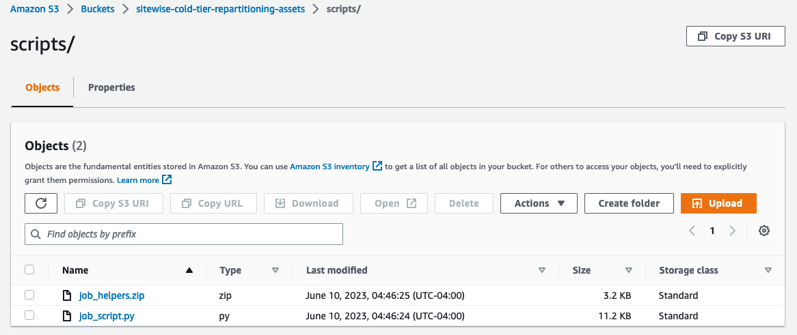
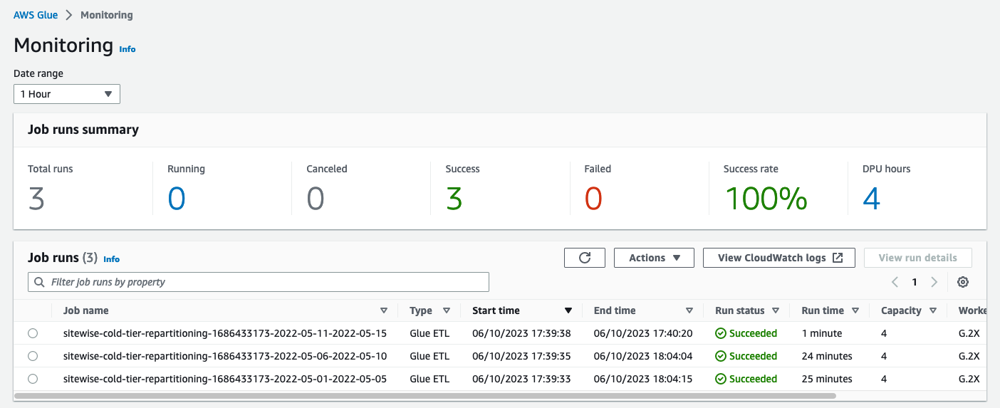

# AWS IoT SiteWise cold tier Re-partitioning

## Table of contents
1. [About this Repo](#about-this-repo)
2. [How does it work?](#how-does-it-work)
3. [Prerequisites](#prerequisites)
4. [How to use?](#how-to-use)
    1. [Configure](#1-configure)
    2. [Prepare the dependencies for AWS Glue ETL jobs](#2-prepare-the-dependencies-for-aws-glue-etl-jobs)
    3. [Execute ETL jobs to re-partition IoT SiteWise cold tier data](#3-execute-etl-jobs-to-re-partition-iot-sitewise-cold-tier-data)
    4. [Clean up the jobs](#4-clean-up-the-jobs)
5. [Stages in a job](#stages-in-a-job)
    1. [Download raw data from IoT SiteWise cold tier storage](#1-download-raw-data-from-iot-sitewise-cold-tier-storage)
    2. [Merge data into daily partitions](#2-merge-data-into-daily-partitions)
    3. [Upload re-partitioned data to target S3 bucket](#3-upload-re-partitioned-data-to-target-s3-bucket)
6. [Improvements](#improvements)

## About this Repo
This repo provides code samples to re-partition the AWS IoT SiteWise cold storage tier data and store it into a destination Amazon S3 bucket. Re-partitioning helps with improving Athena query performance for query patterns encompassing multiple time series.

## How does it work?
The samples provided downloads time series objects from cold tier S3 bucket, merges them into daily partitions, and finally, uploads to a destination S3 bucket. Post initial-run, only new data additions are re-partitioned. Following are a few supported scenarios.

|Change in Asset Modeling | Supported? | 
|----|----|
| No change, all existing assets and properties | Y |
| New properties added to an existing asset | Y |
| New assets added | Y |
| New datastream mapped to an existing property | Y |

## Prerequisites
1. Configure [AWS credentials](https://boto3.amazonaws.com/v1/documentation/api/latest/guide/credentials.html) either using config file or shared credential file. Ensure your region is configured in the config file.
2. You are expected to have specific permissions to access Amazon S3, AWS IAM and AWS Glue as mentioned below. Replace the placeholders with property values as explained in [Configure](#1-configure) section.
    
    ```json
    {
        "Version": "2012-10-17",
        "Statement": [
            {
                "Effect": "Allow",
                "Action": [
                    "s3:PutObject"
                ],
                "Resource": "<ARN of s3.glue_assets.bucket_name>/*"
            },
            {
                "Effect": "Allow",
                "Action": "iam:PassRole",
                "Resource": "<glue_role_arn>"
            },
            {
                "Effect": "Allow",
                "Action": [
                    "glue:CreateJob",
                    "glue:StartJob*",
                    "glue:DeleteJob",
                    "glue:GetJob*"
                ],
                "Resource": "*"
            }
        ]
    }
    ```
3. Ensure Python 3 is installed on your system, you can verify by running `python3 --version` or `python --version` (on Windows).
4. Clone this `Git` repository and install required Python packages by running `pip3 install -r requirements.txt`
5. Ensure `make` utility is installed on your system, you can verify by running `make --version`. You can manually download the source code from [GNU Make website](https://www.gnu.org/software/make) or [Make for Windows](https://gnuwin32.sourceforge.net/packages/make.htm) (for Windows OS).

## How to use?
### 1) Configure
Review and update the configuration in the [config.yml](config.yml) and [Makefile](Makefile) files.

|Property | Description | Default Value |
|----|----|----|
|`timeseries_type` | The type of time series to include ASSOCIATED or DISASSOCIATED | `ASSOCIATED` |
|`s3.cold_tier.bucket_name` | Name of the S3 bucket configured in AWS IoT SiteWise cold tier settings|
|`s3.cold_tier.data_prefix` | Root prefix of all date partitions for data objects | `raw/` |
|`s3.repartitioned.bucket_name` | Name of the S3 bucket to store the re-partitioned data|
|`s3.repartitioned.data_prefix` | Root prefix of all date partitions for data objects | `consolidated/` |
|`s3.repartitioned.index_prefix` | Root prefix of all date partitions for index objects | `index/` |
|`s3.glue_assets.bucket_name` | Name of the S3 bucket to store the assets required by Glue ETL jobs|
|`s3.glue_assets.scripts_prefix` | Prefix of all script artifacts required by Glue ETL jobs | `scripts/` |
|`profile` | Profile used for AWS credentials, change if using non-default profile | `default` |
|`python_alias` | Alias for running python commands. Change to `python` for Windows OS | `python3` |
|`job_name_prefix` | Prefix of job name | `sitewise-cold-tier-repartitioning` |
|`glue_role_arn` | ARN of the IAM role associated with the job|

> **Note**
> It is recommended to use server-side encryption for S3 buckets to protect data at rest.

The IAM role mapped to `glue_role_arn` has the following requirements:
1. Name of the role must start with the string `AWSGlueServiceRole`, e.g., `AWSGlueServiceRole-SiteWiseRepartitioning`.
2. Ensure the role has necessary permissions to access Amazon S3, AWS KMS, AWS IoT SiteWise and Amazon CloudWatch.
    * The [glue_role_policy.json](glue_role_policy.json) sample policy document provides list of required permissions.
    * If server-side encryption with SSE-S3 is used, remove the statement for KMS permissions.

### 2) Prepare the dependencies for AWS Glue ETL jobs

Run `make build` to build and package the scripts required by AWS Glue ETL jobs. 

The following files will be uploaded to the S3 bucket configured at `s3.glue_assets.bucket_name`:
* **job_helpers.zip** - helper scripts that will be provided to AWS Glue as additional Python modules 
* **job_script.py** - script that runs an ETL job



### 3) Execute ETL jobs to re-partition IoT SiteWise cold tier data

Run `make execute {from} {to} {days_per_job}` to create ETL jobs for processing data between a given date range.

|Option | Description |
|----|----|
|`from` (string) | Start date in '%Y-%m-%d' format |
|`to` (string) | End date in '%Y-%m-%d' format |
|`days_per_job` (integer) | Maximum number of days to be processed by a single job |

**Example**: `make execute from=2023-05-01 to=2023-05-15 days_per_job=5`

Several ETL jobs will be created to horizontally scale the work depending on the parallelization defined at `days_per_job`. The table below provides a few examples:
|`from` | `to` | # of days | `days_per_job` | # of jobs |
|----|----|----|----|----|
| 2022-01-01 | 2022-01-31 | 31 | 1 | 31 |
| 2022-01-01 | 2022-01-31 | 31 | 5 | 7 |
| 2022-01-01 | 2022-12-31 | 365 | 10 | 37 |
| 2022-01-01 | 2022-12-31 | 365 | 30 | 13 |

> **Warning**
> The following service quotas for [AWS IoT SiteWise](https://docs.aws.amazon.com/general/latest/gr/iot-sitewise.html) and [AWS Glue](https://docs.aws.amazon.com/general/latest/gr/glue.html) may cause the jobs to fail. In this case, you may need to request AWS to increase the quota for your account.
> * Request rate for ListTimeSeries
> * Max concurrent job runs per account
> * Max jobs per account

> **Warning**
> Exclude days that have only partial data for properties at a day level. Each day provided is expected to have data that is either All or Nothing for each property.

Here is a sample output showing the jobs created:
  
    Creating 3 Glue ETL jobs to process data between 2022-05-01 and 2022-05-15..
        Created job sitewise-cold-tier-repartitioning-1686433173-2022-05-01-2022-05-05
        Created job sitewise-cold-tier-repartitioning-1686433173-2022-05-06-2022-05-10
        Created job sitewise-cold-tier-repartitioning-1686433173-2022-05-11-2022-05-15

You can track the status of jobs at **[AWS Glue Studio](https://console.aws.amazon.com/gluestudio/home)** &rarr; **View monitoring**

> **Note**
> Each job is created with a tag "source: sitewise-repartitioning" for tracking purposes. This tag will be used to clean up the jobs, when needed.



### 4) Clean up the jobs

Run `make cleanup` to delete the ended jobs. Only ended jobs with the tag "source: sitewise-repartitioning" will be deleted so any jobs created outside the context of this project are not deleted.

    Removing all ended jobs..
        REMOVED - Name: sitewise-cold-tier-repartitioning-1687563866-2022-02-10-2022-03-01
        SKIPPED - Name: sitewise-cold-tier-repartitioning-1687563866-2022-03-02-2022-03-21
        REMOVED - Name: sitewise-cold-tier-repartitioning-1687563866-2022-01-01-2022-01-20
        SKIPPED - Name: sitewise-cold-tier-repartitioning-1687563866-2022-03-22-2022-04-10
        REMOVED - Name: sitewise-cold-tier-repartitioning-1687563960-2022-04-06-2022-04-10
        REMOVED - Name: sitewise-cold-tier-repartitioning-1687563866-2022-01-21-2022-02-09
    Removed 5 ended jobs
    Skipped 4 jobs that are not ended

## Stages in a job

Each job consists of three main stages as outlined below. You can monitor and troubleshoot these stages using the logs at **[Amazon CloudWatch](https://console.aws.amazon.com/cloudwatch/home)** &rarr; **Logs** &rarr; **Log groups** &rarr; `/aws-glue/jobs/output`
### 1) Download raw data from IoT SiteWise cold tier storage
In this stage, AVRO data files for the given date range are downloaded from the IoT SiteWise cold tier S3 bucket. If the data has already been processed previously for a given day (tracked in `timeseries.txt`), the script skips downloading the data for the day.

`timeseries.txt` - a new-line delimited plain text file that stores the list of all time series ids processed in previous runs.

If there's new data, corresponding S3 objects will be downloaded to day-wise local directories

    Reviewing --> year: 2022, month: 5, day: 5
        Retrieving all keys with prefix: raw/startYear=2022/startMonth=5/startDay=5/
        # of new timeseries detected: 1200
        Found new data to process, starting to download
        Downloading S3 objects..
            ** Download time: 43 secs **

If no new data is found, no further processing happens for the day

    Reviewing --> year: 2022, month: 5, day: 11
        Retrieving all keys with prefix: raw/startYear=2022/startMonth=5/startDay=11/
        # of timeseries previously processed: 1200
        Skip, no new data

### 2) Merge data into daily partitions
Once the AVRO files are downloaded from IOT SiteWise cold tier S3 bucket, they are merged into a single AVRO file per day.

| Before | After | 
| -- | -- | -- |
| Multiple `.AVRO` files per day | Single `.AVRO` file per day |
| `timeseries.txt` and optionally `previous_timeseries.txt` per day | Single `timeseries.txt` file per day |

Here is a sample output:

    Started merging AVRO data files and index files for each day
    2022-5-5: ** Merge Time: 247 secs **
    2022-5-4: ** Merge Time: 246 secs ** 

### 3) Upload re-partitioned data to target S3 bucket

The merged AVRO files are then uploaded into the destination S3 bucket configured at `s3.repartitioned.bucket_name`.

Here is a sample output:

    Started uploading re-partitioned AVRO data files and index file for each day
    2022-5-5: ** Upload Time: 0 secs **
    2023-5-4: ** Upload Time: 0 secs **

## Improvements

Consider automating the workflow by leveraging [Amazon S3 Event Notifications](https://docs.aws.amazon.com/AmazonS3/latest/userguide/EventNotifications.html), [Amazon Simple Queue Service](https://aws.amazon.com/sqs), and [AWS Lambda](https://aws.amazon.com/lambda)